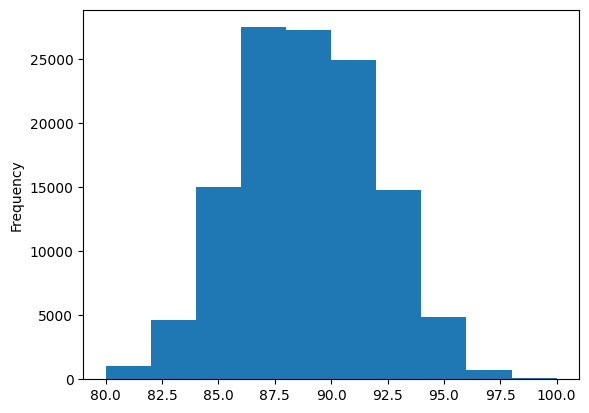
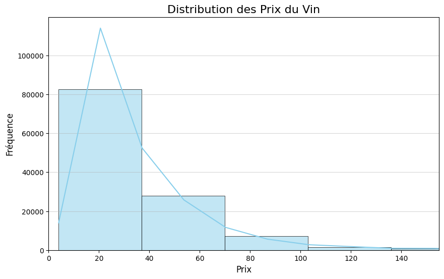
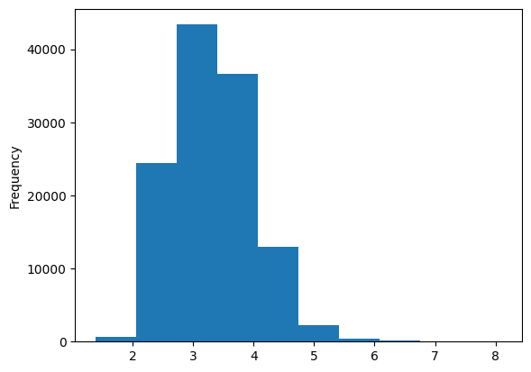

```python
import numpy as np
import pandas as pd


```


```python
# ouvertures et premières infos sur le dataset
df=pd.read_csv('winemag-data-130k-v2.csv')
display(df.info())
display(df.head(5))
print("Basics statistics: ")
data_desc = df.describe(include='all')
display(data_desc)
print()

print("Percentage of missing values: ")
display(100*df.isnull().sum()/df.shape[0])

```

    <class 'pandas.core.frame.DataFrame'>
    RangeIndex: 129971 entries, 0 to 129970
    Data columns (total 14 columns):
     #   Column                 Non-Null Count   Dtype  
    ---  ------                 --------------   -----  
     0   id                     129971 non-null  int64  
     1   country                129908 non-null  object 
     2   description            129971 non-null  object 
     3   designation            92506 non-null   object 
     4   points                 129971 non-null  int64  
     5   price                  120975 non-null  float64
     6   province               129908 non-null  object 
     7   region_1               108724 non-null  object 
     8   region_2               50511 non-null   object 
     9   taster_name            103727 non-null  object 
     10  taster_twitter_handle  98758 non-null   object 
     11  title                  129971 non-null  object 
     12  variety                129970 non-null  object 
     13  winery                 129971 non-null  object 
    dtypes: float64(1), int64(2), object(11)
    memory usage: 13.9+ MB


    None


<div>
<style scoped>
    .dataframe tbody tr th:only-of-type {
        vertical-align: middle;
    }

    .dataframe tbody tr th {
        vertical-align: top;
    }

    .dataframe thead th {
        text-align: right;
    }
</style>
<table border="1" class="dataframe">
  <thead>
    <tr style="text-align: right;">
      <th></th>
      <th>id</th>
      <th>country</th>
      <th>description</th>
      <th>designation</th>
      <th>points</th>
      <th>price</th>
      <th>province</th>
      <th>region_1</th>
      <th>region_2</th>
      <th>taster_name</th>
      <th>taster_twitter_handle</th>
      <th>title</th>
      <th>variety</th>
      <th>winery</th>
    </tr>
  </thead>
  <tbody>
    <tr>
      <th>0</th>
      <td>0</td>
      <td>Italy</td>
      <td>Aromas include tropical fruit, broom, brimston...</td>
      <td>Vulkà Bianco</td>
      <td>87</td>
      <td>NaN</td>
      <td>Sicily &amp; Sardinia</td>
      <td>Etna</td>
      <td>NaN</td>
      <td>Kerin O’Keefe</td>
      <td>@kerinokeefe</td>
      <td>Nicosia 2013 Vulkà Bianco  (Etna)</td>
      <td>White Blend</td>
      <td>Nicosia</td>
    </tr>
    <tr>
      <th>1</th>
      <td>1</td>
      <td>Portugal</td>
      <td>This is ripe and fruity, a wine that is smooth...</td>
      <td>Avidagos</td>
      <td>87</td>
      <td>15.0</td>
      <td>Douro</td>
      <td>NaN</td>
      <td>NaN</td>
      <td>Roger Voss</td>
      <td>@vossroger</td>
      <td>Quinta dos Avidagos 2011 Avidagos Red (Douro)</td>
      <td>Portuguese Red</td>
      <td>Quinta dos Avidagos</td>
    </tr>
    <tr>
      <th>2</th>
      <td>2</td>
      <td>US</td>
      <td>Tart and snappy, the flavors of lime flesh and...</td>
      <td>NaN</td>
      <td>87</td>
      <td>14.0</td>
      <td>Oregon</td>
      <td>Willamette Valley</td>
      <td>Willamette Valley</td>
      <td>Paul Gregutt</td>
      <td>@paulgwine</td>
      <td>Rainstorm 2013 Pinot Gris (Willamette Valley)</td>
      <td>Pinot Gris</td>
      <td>Rainstorm</td>
    </tr>
    <tr>
      <th>3</th>
      <td>3</td>
      <td>US</td>
      <td>Pineapple rind, lemon pith and orange blossom ...</td>
      <td>Reserve Late Harvest</td>
      <td>87</td>
      <td>13.0</td>
      <td>Michigan</td>
      <td>Lake Michigan Shore</td>
      <td>NaN</td>
      <td>Alexander Peartree</td>
      <td>NaN</td>
      <td>St. Julian 2013 Reserve Late Harvest Riesling ...</td>
      <td>Riesling</td>
      <td>St. Julian</td>
    </tr>
    <tr>
      <th>4</th>
      <td>4</td>
      <td>US</td>
      <td>Much like the regular bottling from 2012, this...</td>
      <td>Vintner's Reserve Wild Child Block</td>
      <td>87</td>
      <td>65.0</td>
      <td>Oregon</td>
      <td>Willamette Valley</td>
      <td>Willamette Valley</td>
      <td>Paul Gregutt</td>
      <td>@paulgwine</td>
      <td>Sweet Cheeks 2012 Vintner's Reserve Wild Child...</td>
      <td>Pinot Noir</td>
      <td>Sweet Cheeks</td>
    </tr>
  </tbody>
</table>
</div>


    Basics statistics: 


<div>
<style scoped>
    .dataframe tbody tr th:only-of-type {
        vertical-align: middle;
    }

    .dataframe tbody tr th {
        vertical-align: top;
    }

    .dataframe thead th {
        text-align: right;
    }
</style>
<table border="1" class="dataframe">
  <thead>
    <tr style="text-align: right;">
      <th></th>
      <th>id</th>
      <th>country</th>
      <th>description</th>
      <th>designation</th>
      <th>points</th>
      <th>price</th>
      <th>province</th>
      <th>region_1</th>
      <th>region_2</th>
      <th>taster_name</th>
      <th>taster_twitter_handle</th>
      <th>title</th>
      <th>variety</th>
      <th>winery</th>
    </tr>
  </thead>
  <tbody>
    <tr>
      <th>count</th>
      <td>129971.000000</td>
      <td>129908</td>
      <td>129971</td>
      <td>92506</td>
      <td>129971.000000</td>
      <td>120975.000000</td>
      <td>129908</td>
      <td>108724</td>
      <td>50511</td>
      <td>103727</td>
      <td>98758</td>
      <td>129971</td>
      <td>129970</td>
      <td>129971</td>
    </tr>
    <tr>
      <th>unique</th>
      <td>NaN</td>
      <td>43</td>
      <td>119955</td>
      <td>37976</td>
      <td>NaN</td>
      <td>NaN</td>
      <td>425</td>
      <td>1229</td>
      <td>17</td>
      <td>19</td>
      <td>15</td>
      <td>118840</td>
      <td>707</td>
      <td>16757</td>
    </tr>
    <tr>
      <th>top</th>
      <td>NaN</td>
      <td>US</td>
      <td>Gravenstein apple, honeysuckle and jasmine aro...</td>
      <td>Reserve</td>
      <td>NaN</td>
      <td>NaN</td>
      <td>California</td>
      <td>Napa Valley</td>
      <td>Central Coast</td>
      <td>Roger Voss</td>
      <td>@vossroger</td>
      <td>Gloria Ferrer NV Sonoma Brut Sparkling (Sonoma...</td>
      <td>Pinot Noir</td>
      <td>Wines &amp; Winemakers</td>
    </tr>
    <tr>
      <th>freq</th>
      <td>NaN</td>
      <td>54504</td>
      <td>3</td>
      <td>2009</td>
      <td>NaN</td>
      <td>NaN</td>
      <td>36247</td>
      <td>4480</td>
      <td>11065</td>
      <td>25514</td>
      <td>25514</td>
      <td>11</td>
      <td>13272</td>
      <td>222</td>
    </tr>
    <tr>
      <th>mean</th>
      <td>64985.000000</td>
      <td>NaN</td>
      <td>NaN</td>
      <td>NaN</td>
      <td>88.447138</td>
      <td>35.363389</td>
      <td>NaN</td>
      <td>NaN</td>
      <td>NaN</td>
      <td>NaN</td>
      <td>NaN</td>
      <td>NaN</td>
      <td>NaN</td>
      <td>NaN</td>
    </tr>
    <tr>
      <th>std</th>
      <td>37519.540256</td>
      <td>NaN</td>
      <td>NaN</td>
      <td>NaN</td>
      <td>3.039730</td>
      <td>41.022218</td>
      <td>NaN</td>
      <td>NaN</td>
      <td>NaN</td>
      <td>NaN</td>
      <td>NaN</td>
      <td>NaN</td>
      <td>NaN</td>
      <td>NaN</td>
    </tr>
    <tr>
      <th>min</th>
      <td>0.000000</td>
      <td>NaN</td>
      <td>NaN</td>
      <td>NaN</td>
      <td>80.000000</td>
      <td>4.000000</td>
      <td>NaN</td>
      <td>NaN</td>
      <td>NaN</td>
      <td>NaN</td>
      <td>NaN</td>
      <td>NaN</td>
      <td>NaN</td>
      <td>NaN</td>
    </tr>
    <tr>
      <th>25%</th>
      <td>32492.500000</td>
      <td>NaN</td>
      <td>NaN</td>
      <td>NaN</td>
      <td>86.000000</td>
      <td>17.000000</td>
      <td>NaN</td>
      <td>NaN</td>
      <td>NaN</td>
      <td>NaN</td>
      <td>NaN</td>
      <td>NaN</td>
      <td>NaN</td>
      <td>NaN</td>
    </tr>
    <tr>
      <th>50%</th>
      <td>64985.000000</td>
      <td>NaN</td>
      <td>NaN</td>
      <td>NaN</td>
      <td>88.000000</td>
      <td>25.000000</td>
      <td>NaN</td>
      <td>NaN</td>
      <td>NaN</td>
      <td>NaN</td>
      <td>NaN</td>
      <td>NaN</td>
      <td>NaN</td>
      <td>NaN</td>
    </tr>
    <tr>
      <th>75%</th>
      <td>97477.500000</td>
      <td>NaN</td>
      <td>NaN</td>
      <td>NaN</td>
      <td>91.000000</td>
      <td>42.000000</td>
      <td>NaN</td>
      <td>NaN</td>
      <td>NaN</td>
      <td>NaN</td>
      <td>NaN</td>
      <td>NaN</td>
      <td>NaN</td>
      <td>NaN</td>
    </tr>
    <tr>
      <th>max</th>
      <td>129970.000000</td>
      <td>NaN</td>
      <td>NaN</td>
      <td>NaN</td>
      <td>100.000000</td>
      <td>3300.000000</td>
      <td>NaN</td>
      <td>NaN</td>
      <td>NaN</td>
      <td>NaN</td>
      <td>NaN</td>
      <td>NaN</td>
      <td>NaN</td>
      <td>NaN</td>
    </tr>
  </tbody>
</table>
</div>


    
    Percentage of missing values: 


    id                        0.000000
    country                   0.048472
    description               0.000000
    designation              28.825661
    points                    0.000000
    price                     6.921544
    province                  0.048472
    region_1                 16.347493
    region_2                 61.136715
    taster_name              20.192197
    taster_twitter_handle    24.015357
    title                     0.000000
    variety                   0.000769
    winery                    0.000000
    dtype: float64


**Décision 1** : Je ne vais pas utiliser les colonnes suivantes : 

- points : mon cas d'usage est une estimation du prix avant la notation d'un expert (et peu de variance dans la variable)  
- region_1, région_2 :  trop de valeurs nulles, des contenus en doublon (entre province, région1,région2)
- taster_name : pas utile  
- taster_twitter_handle : pas utilse


```python
# supression des valeurs nulles pour la variable à prédire et pour le pays (très peu de valeurs nulles)
df = df.dropna(subset=['price', 'country'])

```


```python
# étude de la corrélation entre la colonne points et price
print(df[["price", "points"]].corr())
df['points'].plot(kind='hist')
print(df["points"].var())

```

               price    points
    price   1.000000  0.416197
    points  0.416197  1.000000
    9.271671038613304


    

    


```python
# courbe de distribution du prix : 
import matplotlib.pyplot as plt
import seaborn as sns

plt.figure(figsize=(10, 6))

# Histogramme et estimation de la densité (KDE)
sns.histplot(df['price'], bins=100, kde=True, color='skyblue', edgecolor='black')

# Ajout des titres et labels
plt.title('Distribution des Prix du Vin', fontsize=16)
plt.xlabel('Prix', fontsize=12)
plt.ylabel('Fréquence', fontsize=12)
plt.grid(axis='y', alpha=0.5)

# limite pour l'axe des x si la distribution est trop asymétrique
# (Pour mieux visualiser la masse des données, car les outliers très chers peuvent écraser le graphique)
max_price_display = df['price'].quantile(0.99) # On affiche jusqu'au 99e percentile
plt.xlim(0, max_price_display)
plt.show()


```


    

    


```python
skewness = df['price'].skew()
print(f"Skewness de la distribution : {skewness:.2f}")
```

    Skewness de la distribution : 18.00


la distribution ressemble à une lognormale, on va appliquer une transformation avec le log pour  

  - garder les valeurs importantes dans le dataset, car c'est une info important pour certains vins  (on ne rejette pas les valeurs extremes)
  - réduire la taille des nombres pour faciliter les calculs  

**decision 2**, je vais prédire le log de ma variable prix (cible)


```python
# ajout de la colonne LOG et affichage simple de la distribution
df['log_price']=np.log(df['price'])
df['log_price'].plot(kind='hist')
df['log_price'].describe()


```


    count    120916.000000
    mean          3.314728
    std           0.654123
    min           1.386294
    25%           2.833213
    50%           3.218876
    75%           3.737670
    max           8.101678
    Name: log_price, dtype: float64


    

    


```python
# étude sur la colonne country
# 1. Calculer le nombre total
total_vins = len(df)

# 2. Calculer le décompte et le pourcentage
country_counts = df['country'].value_counts()
country_percentages = (country_counts / total_vins) * 100

# 3. Créer le DataFrame de statistiques et le trier
country_stats = pd.DataFrame({
    'Count': country_counts,
    'Percentage (%)': country_percentages.round(2)
})
country_stats = country_stats.sort_values(by='Count', ascending=False)


# 4. CALCULER LE POURCENTAGE CUMULÉ
country_stats['Cumulative Percentage (%)'] = country_stats['Percentage (%)'].cumsum().round(2)


# 5. Afficher le classement
print("--- Classement des Pays avec Pourcentage Cumulé ---")
print(country_stats)

```

    --- Classement des Pays avec Pourcentage Cumulé ---
                            Count  Percentage (%)  Cumulative Percentage (%)
    country                                                                 
    US                      54265           44.88                      44.88
    France                  17776           14.70                      59.58
    Italy                   16914           13.99                      73.57
    Spain                    6573            5.44                      79.01
    Portugal                 4875            4.03                      83.04
    Chile                    4416            3.65                      86.69
    Argentina                3756            3.11                      89.80
    Austria                  2799            2.31                      92.11
    Australia                2294            1.90                      94.01
    Germany                  2120            1.75                      95.76
    New Zealand              1378            1.14                      96.90
    South Africa             1293            1.07                      97.97
    Israel                    489            0.40                      98.37
    Greece                    461            0.38                      98.75
    Canada                    254            0.21                      98.96
    Hungary                   145            0.12                      99.08
    Bulgaria                  141            0.12                      99.20
    Romania                   120            0.10                      99.30
    Uruguay                   109            0.09                      99.39
    Turkey                     90            0.07                      99.46
    Georgia                    84            0.07                      99.53
    Slovenia                   80            0.07                      99.60
    Croatia                    71            0.06                      99.66
    Mexico                     70            0.06                      99.72
    England                    69            0.06                      99.78
    Moldova                    59            0.05                      99.83
    Brazil                     47            0.04                      99.87
    Lebanon                    35            0.03                      99.90
    Morocco                    28            0.02                      99.92
    Peru                       16            0.01                      99.93
    Ukraine                    14            0.01                      99.94
    Czech Republic             12            0.01                      99.95
    Macedonia                  12            0.01                      99.96
    Serbia                     12            0.01                      99.97
    Cyprus                     11            0.01                      99.98
    India                       9            0.01                      99.99
    Switzerland                 7            0.01                     100.00
    Luxembourg                  6            0.00                     100.00
    Bosnia and Herzegovina      2            0.00                     100.00
    Armenia                     2            0.00                     100.00
    Slovakia                    1            0.00                     100.00
    China                       1            0.00                     100.00


la catégorie est étendue avec beaucoup de petites valeurs, je ne vais concerne que celle présente à plus de 1%
et créer une catégorie "other" pour les autres


```python
def group_rare_categories(df, column, threshold=0.01):
    """
    Regroupe les catégories rares (sous le seuil de fréquence) en 'Other'.
    
    """
    value_counts = df[column].value_counts(normalize=True)
    rare_categories = value_counts[value_counts < threshold].index
    
    # Créer une copie pour éviter SettingWithCopyWarning
    df_temp = df.copy() 
    df_temp[column] = np.where(df_temp[column].isin(rare_categories), 'Other', df_temp[column])
    return df_temp[column]
df['country']=group_rare_categories(df,'country',threshold=0.01)

```


```python
df['country'].value_counts()

```


    country
    US              54265
    France          17776
    Italy           16914
    Spain            6573
    Portugal         4875
    Chile            4416
    Argentina        3756
    Austria          2799
    Other            2457
    Australia        2294
    Germany          2120
    New Zealand      1378
    South Africa     1293
    Name: count, dtype: int64


```python
#Etude sur province
df.query('country != "other"')['province'].value_counts()
df.query('country != "other"')['province'].nunique()
```


    422


```python
total_vins = len(df)

# 2. Calculer le décompte et le pourcentage
country_counts = df['province'].value_counts()
country_percentages = (country_counts / total_vins) * 100

# 3. Créer le DataFrame de statistiques et le trier
country_stats = pd.DataFrame({
    'Count': country_counts,
    'Percentage (%)': country_percentages.round(2)
})
country_stats = country_stats.sort_values(by='Count', ascending=False)


# 4. CALCULER LE POURCENTAGE CUMULÉ
country_stats['Cumulative Percentage (%)'] = country_stats['Percentage (%)'].cumsum().round(2)


# 5. Afficher le classement
print("--- Classement des provinces avec Pourcentage Cumulé ---")
print(country_stats.head(20))


```

    --- Classement des provinces avec Pourcentage Cumulé ---
                        Count  Percentage (%)  Cumulative Percentage (%)
    province                                                            
    California          36104           29.86                      29.86
    Washington           8583            7.10                      36.96
    Oregon               5359            4.43                      41.39
    Tuscany              5128            4.24                      45.63
    Bordeaux             4002            3.31                      48.94
    Northern Spain       3797            3.14                      52.08
    Mendoza Province     3226            2.67                      54.75
    Burgundy             3106            2.57                      57.32
    Piedmont             3089            2.55                      59.87
    New York             2676            2.21                      62.08
    Veneto               2315            1.91                      63.99
    Alsace               2147            1.78                      65.77
    Northeastern Italy   1986            1.64                      67.41
    Loire Valley         1598            1.32                      68.73
    Sicily & Sardinia    1559            1.29                      70.02
    Champagne            1383            1.14                      71.16
    Southwest France     1335            1.10                      72.26
    South Australia      1331            1.10                      73.36
    Catalonia            1153            0.95                      74.31
    Provence             1139            0.94                      75.25


la réparition est un peu plus équilibrée que pour country, je ne vais pas utiliser de catégorie other mais :   
**decision 3** : utiliser directement un encodage type "target_encoding" sur la feature province


```python
# on voit que dans la colonne title, on trouve l'année du vin, le millesime. C'est une variable qui peut avoir son importance dans le prix d'un vin
# on va l'etraire de la colonne titel
from datetime import datetime
import re
def extract_year(text):
    """
    Extrait le millésime (année à 4 chiffres) du titre.
    """
    if pd.isna(text):
        return np.nan
    
    annee_courante = datetime.now().year
    regex_annee = r'(\d{4})'

    # Trouve toutes les occurrences de 4 chiffres
    years = re.findall(regex_annee, str(text))
    
    # Convertit en int et filtre les années plausibles (> 1920 et < année en cours)
    # Note: On conserve le 1920 comme borne basse sécuritaire
    years = [int(y) for y in years if (int(y) > 1920 and int(y) < annee_courante)]
    
    # Retourne la plus grande année trouvée, ou np.nan si aucune
    return max(years) if years else np.nan

df['millesime'] = df['title'].apply(extract_year)

```


```python
df['millesime'].describe(include='all').T

```


    count    116764.000000
    mean       2010.732546
    std           3.671831
    min        1927.000000
    25%        2009.000000
    50%        2011.000000
    75%        2013.000000
    max        2017.000000
    Name: millesime, dtype: float64


```python
df.query('millesime < 1960 ')
```


<div>
<style scoped>
    .dataframe tbody tr th:only-of-type {
        vertical-align: middle;
    }

    .dataframe tbody tr th {
        vertical-align: top;
    }

    .dataframe thead th {
        text-align: right;
    }
</style>
<table border="1" class="dataframe">
  <thead>
    <tr style="text-align: right;">
      <th></th>
      <th>id</th>
      <th>country</th>
      <th>description</th>
      <th>designation</th>
      <th>points</th>
      <th>price</th>
      <th>province</th>
      <th>region_1</th>
      <th>region_2</th>
      <th>taster_name</th>
      <th>taster_twitter_handle</th>
      <th>title</th>
      <th>variety</th>
      <th>winery</th>
      <th>millesime</th>
    </tr>
  </thead>
  <tbody>
    <tr>
      <th>41441</th>
      <td>41441</td>
      <td>Portugal</td>
      <td>This was a great vintage Port year, and this w...</td>
      <td>Colheita White</td>
      <td>94</td>
      <td>980.0</td>
      <td>Port</td>
      <td>NaN</td>
      <td>NaN</td>
      <td>Roger Voss</td>
      <td>@vossroger</td>
      <td>Kopke 1935 Colheita White  (Port)</td>
      <td>Port</td>
      <td>Kopke</td>
      <td>1935.0</td>
    </tr>
    <tr>
      <th>51898</th>
      <td>51898</td>
      <td>Spain</td>
      <td>This gorgeous dessert wine shows a coffee-colo...</td>
      <td>Don PX Reserva Especial</td>
      <td>93</td>
      <td>258.0</td>
      <td>Andalucia</td>
      <td>Montilla-Moriles</td>
      <td>NaN</td>
      <td>Michael Schachner</td>
      <td>@wineschach</td>
      <td>Bodegas Toro Albala, SL 1947 Don PX Reserva Es...</td>
      <td>Pedro Ximénez</td>
      <td>Bodegas Toro Albala, SL</td>
      <td>1947.0</td>
    </tr>
    <tr>
      <th>54748</th>
      <td>54748</td>
      <td>Spain</td>
      <td>A rank well above most PX sweeties, with lush ...</td>
      <td>Solera 1927</td>
      <td>94</td>
      <td>25.0</td>
      <td>Andalucia</td>
      <td>Montilla-Moriles</td>
      <td>NaN</td>
      <td>Michael Schachner</td>
      <td>@wineschach</td>
      <td>Alvear NV Solera 1927 Pedro Ximénez (Montilla-...</td>
      <td>Pedro Ximénez</td>
      <td>Alvear</td>
      <td>1927.0</td>
    </tr>
    <tr>
      <th>78299</th>
      <td>78299</td>
      <td>Portugal</td>
      <td>There is a great balance between acidity and i...</td>
      <td>Colheita Tawny</td>
      <td>95</td>
      <td>375.0</td>
      <td>Port</td>
      <td>NaN</td>
      <td>NaN</td>
      <td>Roger Voss</td>
      <td>@vossroger</td>
      <td>Kopke 1957 Colheita Tawny  (Port)</td>
      <td>Port</td>
      <td>Kopke</td>
      <td>1957.0</td>
    </tr>
    <tr>
      <th>82827</th>
      <td>82827</td>
      <td>Portugal</td>
      <td>Harvested the year a princess became Queen Eli...</td>
      <td>Porto Envelhecido em Casco Colheita</td>
      <td>95</td>
      <td>499.0</td>
      <td>Port</td>
      <td>NaN</td>
      <td>NaN</td>
      <td>Roger Voss</td>
      <td>@vossroger</td>
      <td>Messias 1952 Porto Envelhecido em Casco Colhei...</td>
      <td>Port</td>
      <td>Messias</td>
      <td>1952.0</td>
    </tr>
    <tr>
      <th>87131</th>
      <td>87131</td>
      <td>Portugal</td>
      <td>This is an astonishing wine for its age. It sh...</td>
      <td>Colheita Tawny</td>
      <td>96</td>
      <td>415.0</td>
      <td>Port</td>
      <td>NaN</td>
      <td>NaN</td>
      <td>Roger Voss</td>
      <td>@vossroger</td>
      <td>Burmester 1952 Colheita Tawny  (Port)</td>
      <td>Port</td>
      <td>Burmester</td>
      <td>1952.0</td>
    </tr>
    <tr>
      <th>90583</th>
      <td>90583</td>
      <td>Portugal</td>
      <td>While this wine from a year that was not decla...</td>
      <td>Colheita Tawny</td>
      <td>93</td>
      <td>770.0</td>
      <td>Port</td>
      <td>NaN</td>
      <td>NaN</td>
      <td>Roger Voss</td>
      <td>@vossroger</td>
      <td>Kopke 1941 Colheita Tawny  (Port)</td>
      <td>Port</td>
      <td>Kopke</td>
      <td>1941.0</td>
    </tr>
    <tr>
      <th>107854</th>
      <td>107854</td>
      <td>Portugal</td>
      <td>This rare survival comes from Ramisco grapes p...</td>
      <td>Reserva Velho</td>
      <td>93</td>
      <td>495.0</td>
      <td>Colares</td>
      <td>NaN</td>
      <td>NaN</td>
      <td>Roger Voss</td>
      <td>@vossroger</td>
      <td>Adega Viuva Gomes 1934 Reserva Velho Red (Cola...</td>
      <td>Ramisco</td>
      <td>Adega Viuva Gomes</td>
      <td>1934.0</td>
    </tr>
    <tr>
      <th>117205</th>
      <td>117205</td>
      <td>France</td>
      <td>For any serious fan of Rivesaltes, this is a m...</td>
      <td>Legend Vintage</td>
      <td>95</td>
      <td>350.0</td>
      <td>Languedoc-Roussillon</td>
      <td>Rivesaltes</td>
      <td>NaN</td>
      <td>Lauren Buzzeo</td>
      <td>@laurbuzz</td>
      <td>Gérard Bertrand 1945 Legend Vintage Red (Rives...</td>
      <td>Red Blend</td>
      <td>Gérard Bertrand</td>
      <td>1945.0</td>
    </tr>
    <tr>
      <th>119658</th>
      <td>119658</td>
      <td>Spain</td>
      <td>One of the world's best PX wines is Solera 192...</td>
      <td>Solera 1927</td>
      <td>96</td>
      <td>30.0</td>
      <td>Andalucia</td>
      <td>Montilla-Moriles</td>
      <td>NaN</td>
      <td>Michael Schachner</td>
      <td>@wineschach</td>
      <td>Alvear NV Solera 1927 Pedro Ximénez (Montilla-...</td>
      <td>Pedro Ximénez</td>
      <td>Alvear</td>
      <td>1927.0</td>
    </tr>
  </tbody>
</table>
</div>


```python
# des vinns très vieux, peu chers => anormal, je les supprime.
df[((df['millesime'] < 1960) & (df['price'] < 100))]

```


<div>
<style scoped>
    .dataframe tbody tr th:only-of-type {
        vertical-align: middle;
    }

    .dataframe tbody tr th {
        vertical-align: top;
    }

    .dataframe thead th {
        text-align: right;
    }
</style>
<table border="1" class="dataframe">
  <thead>
    <tr style="text-align: right;">
      <th></th>
      <th>id</th>
      <th>country</th>
      <th>description</th>
      <th>designation</th>
      <th>points</th>
      <th>price</th>
      <th>province</th>
      <th>region_1</th>
      <th>region_2</th>
      <th>taster_name</th>
      <th>taster_twitter_handle</th>
      <th>title</th>
      <th>variety</th>
      <th>winery</th>
      <th>millesime</th>
    </tr>
  </thead>
  <tbody>
    <tr>
      <th>54748</th>
      <td>54748</td>
      <td>Spain</td>
      <td>A rank well above most PX sweeties, with lush ...</td>
      <td>Solera 1927</td>
      <td>94</td>
      <td>25.0</td>
      <td>Andalucia</td>
      <td>Montilla-Moriles</td>
      <td>NaN</td>
      <td>Michael Schachner</td>
      <td>@wineschach</td>
      <td>Alvear NV Solera 1927 Pedro Ximénez (Montilla-...</td>
      <td>Pedro Ximénez</td>
      <td>Alvear</td>
      <td>1927.0</td>
    </tr>
    <tr>
      <th>119658</th>
      <td>119658</td>
      <td>Spain</td>
      <td>One of the world's best PX wines is Solera 192...</td>
      <td>Solera 1927</td>
      <td>96</td>
      <td>30.0</td>
      <td>Andalucia</td>
      <td>Montilla-Moriles</td>
      <td>NaN</td>
      <td>Michael Schachner</td>
      <td>@wineschach</td>
      <td>Alvear NV Solera 1927 Pedro Ximénez (Montilla-...</td>
      <td>Pedro Ximénez</td>
      <td>Alvear</td>
      <td>1927.0</td>
    </tr>
  </tbody>
</table>
</div>


```python
df = df[~((df['millesime'] < 1950) & (df['price'] < 100))]
```


```python
# champ description
# taille du texte
print(df['description'].head(5))
print()
print(df['description'].str.len().describe())

```

    1    This is ripe and fruity, a wine that is smooth...
    2    Tart and snappy, the flavors of lime flesh and...
    3    Pineapple rind, lemon pith and orange blossom ...
    4    Much like the regular bottling from 2012, this...
    5    Blackberry and raspberry aromas show a typical...
    Name: description, dtype: object
    
    count    120914.000000
    mean        244.239162
    std          66.619672
    min          20.000000
    25%         199.000000
    50%         239.000000
    75%         284.000000
    max         829.000000
    Name: description, dtype: float64


```python
# étude du vocabulaire 
full_text=" ".join(df['description'].astype(str))
words = re.findall(r"\b\w+\b", full_text.lower())
unique_words = set(words)
nb_unique_words = len(unique_words)

print("Nombre total de mots :", len(words))
print("Nombre de mots uniques :", nb_unique_words)


```

    Nombre total de mots : 5050407
    Nombre de mots uniques : 30288


```python
# etude plus poussée avec spacy (lemmatization, tokenisation)
import spacy
nlp = spacy.load("en_core_web_sm", disable=["parser", "ner", "tagger"]) 
all_tokens = []

for text in df["description"].astype(str):
    doc = nlp(text)
    tokens = [
        token.lemma_.lower()
        for token in doc
        if not token.is_stop and not token.is_punct and not token.is_space
    ]
    all_tokens.extend(tokens)

nb_tokens = len(all_tokens)
nb_unique_tokens = len(set(all_tokens))

print("Tokens nettoyés :", nb_tokens)
print("Tokens uniques :", nb_unique_tokens)
```

    /srv/data/users/pldx653/projets/jedha_docker/.venv/lib/python3.10/site-packages/spacy/pipeline/lemmatizer.py:188: UserWarning: [W108] The rule-based lemmatizer did not find POS annotation for one or more tokens. Check that your pipeline includes components that assign token.pos, typically 'tagger'+'attribute_ruler' or 'morphologizer'.
      warnings.warn(Warnings.W108)


    Tokens nettoyés : 2942329
    Tokens uniques : 31156


**decision 4** je vais utiliser l'algorithme tf-idf pour faire l'embedding de cette colonne (rapide et compatible avec sklearn)


```python
from sklearn.feature_extraction.text import TfidfVectorizer
tfidf_transformer = TfidfVectorizer(
        lowercase=True,
        stop_words='english',
        max_features=500, 
        min_df=5,
        max_df=0.8
)
texts = df["description"].fillna("")
X_tfidf = tfidf_transformer.fit_transform(texts)
```


```python
print(X_tfidf.shape)
print(tfidf_transformer.get_feature_names_out()[:20])

```

    (120916, 500)
    ['10' '100' '15' '20' '2015' '2016' '2017' '2018' '2019' '2020' '2022'
     '2025' '50' 'accent' 'accented' 'accents' 'acid' 'acidic' 'acidity'
     'acids']


```python
tfidf_df = pd.DataFrame(
    X_tfidf.toarray(),
    columns=tfidf_transformer.get_feature_names_out()
)

display(tfidf_df.head())
```


<div>
<style scoped>
    .dataframe tbody tr th:only-of-type {
        vertical-align: middle;
    }

    .dataframe tbody tr th {
        vertical-align: top;
    }

    .dataframe thead th {
        text-align: right;
    }
</style>
<table border="1" class="dataframe">
  <thead>
    <tr style="text-align: right;">
      <th></th>
      <th>10</th>
      <th>100</th>
      <th>15</th>
      <th>20</th>
      <th>2015</th>
      <th>2016</th>
      <th>2017</th>
      <th>2018</th>
      <th>2019</th>
      <th>2020</th>
      <th>...</th>
      <th>wines</th>
      <th>wood</th>
      <th>woody</th>
      <th>year</th>
      <th>years</th>
      <th>yellow</th>
      <th>young</th>
      <th>zest</th>
      <th>zesty</th>
      <th>zinfandel</th>
    </tr>
  </thead>
  <tbody>
    <tr>
      <th>0</th>
      <td>0.0</td>
      <td>0.0</td>
      <td>0.0</td>
      <td>0.0</td>
      <td>0.0</td>
      <td>0.380559</td>
      <td>0.0</td>
      <td>0.0</td>
      <td>0.0</td>
      <td>0.0</td>
      <td>...</td>
      <td>0.0</td>
      <td>0.0</td>
      <td>0.0</td>
      <td>0.0</td>
      <td>0.0</td>
      <td>0.0</td>
      <td>0.0</td>
      <td>0.0</td>
      <td>0.0</td>
      <td>0.0</td>
    </tr>
    <tr>
      <th>1</th>
      <td>0.0</td>
      <td>0.0</td>
      <td>0.0</td>
      <td>0.0</td>
      <td>0.0</td>
      <td>0.000000</td>
      <td>0.0</td>
      <td>0.0</td>
      <td>0.0</td>
      <td>0.0</td>
      <td>...</td>
      <td>0.0</td>
      <td>0.0</td>
      <td>0.0</td>
      <td>0.0</td>
      <td>0.0</td>
      <td>0.0</td>
      <td>0.0</td>
      <td>0.0</td>
      <td>0.0</td>
      <td>0.0</td>
    </tr>
    <tr>
      <th>2</th>
      <td>0.0</td>
      <td>0.0</td>
      <td>0.0</td>
      <td>0.0</td>
      <td>0.0</td>
      <td>0.000000</td>
      <td>0.0</td>
      <td>0.0</td>
      <td>0.0</td>
      <td>0.0</td>
      <td>...</td>
      <td>0.0</td>
      <td>0.0</td>
      <td>0.0</td>
      <td>0.0</td>
      <td>0.0</td>
      <td>0.0</td>
      <td>0.0</td>
      <td>0.0</td>
      <td>0.0</td>
      <td>0.0</td>
    </tr>
    <tr>
      <th>3</th>
      <td>0.0</td>
      <td>0.0</td>
      <td>0.0</td>
      <td>0.0</td>
      <td>0.0</td>
      <td>0.000000</td>
      <td>0.0</td>
      <td>0.0</td>
      <td>0.0</td>
      <td>0.0</td>
      <td>...</td>
      <td>0.0</td>
      <td>0.0</td>
      <td>0.0</td>
      <td>0.0</td>
      <td>0.0</td>
      <td>0.0</td>
      <td>0.0</td>
      <td>0.0</td>
      <td>0.0</td>
      <td>0.0</td>
    </tr>
    <tr>
      <th>4</th>
      <td>0.0</td>
      <td>0.0</td>
      <td>0.0</td>
      <td>0.0</td>
      <td>0.0</td>
      <td>0.000000</td>
      <td>0.0</td>
      <td>0.0</td>
      <td>0.0</td>
      <td>0.0</td>
      <td>...</td>
      <td>0.0</td>
      <td>0.0</td>
      <td>0.0</td>
      <td>0.0</td>
      <td>0.0</td>
      <td>0.0</td>
      <td>0.0</td>
      <td>0.0</td>
      <td>0.0</td>
      <td>0.0</td>
    </tr>
  </tbody>
</table>
<p>5 rows × 500 columns</p>
</div>


```python
word_importance = np.asarray(X_tfidf.sum(axis=0)).ravel()

top_idx = word_importance.argsort()[::-1][:20]  # top 20 mots
top_words = tfidf_transformer.get_feature_names_out()[top_idx]

list(zip(top_words, word_importance[top_idx]))
```


    [('wine', np.float64(7746.856376336443)),
     ('flavors', np.float64(6511.445899568553)),
     ('fruit', np.float64(5866.6720807072015)),
     ('aromas', np.float64(4829.727586935536)),
     ('palate', np.float64(4705.736141742828)),
     ('acidity', np.float64(4621.311979858513)),
     ('finish', np.float64(4618.770669510814)),
     ('drink', np.float64(4161.322064091026)),
     ('cherry', np.float64(4158.463685156642)),
     ('tannins', np.float64(4083.471082671439)),
     ('black', np.float64(4069.672593064638)),
     ('ripe', np.float64(3920.9731222975006)),
     ('red', np.float64(3486.324444582173)),
     ('notes', np.float64(3132.390536159607)),
     ('dry', np.float64(3093.1456653276837)),
     ('oak', np.float64(3059.2224927185434)),
     ('spice', np.float64(3053.0666645028373)),
     ('fresh', np.float64(2985.869586144736)),
     ('rich', np.float64(2913.007319008635)),
     ('berry', np.float64(2869.7735139400443))]


```python
print(df['winery'].nunique())
print(df['variety'].nunique())
```

    15843
    691


## j'arrête ici l'analyse notamment sur ces deux derniers champs que je vais exclure pour le moment (optimisation de mon temps)
